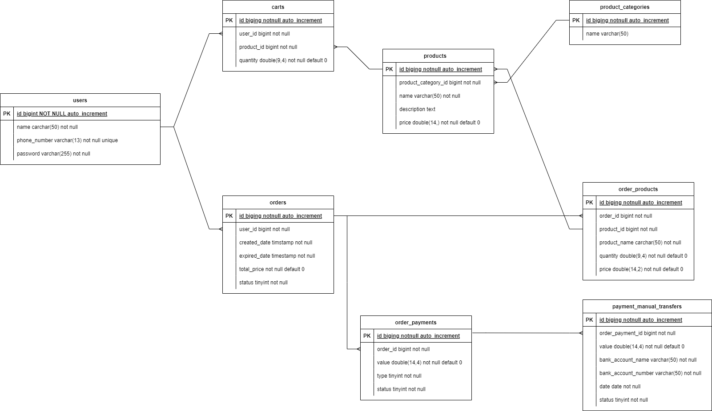

# Synapsis

## Features
- Authentication for register and login
- show product list by category
- add, update & delete product from cart
- checkout cart to order
- confirm payment

## How to Run Locally
```bash
# clone repository
git clone git@github.com:IbnAnjung/sinapsys.git

cd sinapsys

## run with docker
docker-compose up

## run development mode
cp .env.example .env

set -o allexport; source .env; go run main.go
```

## Project Structure
      .
      ├── build                         # build & ci/cd content 
      ├   ├── http.Dockerfile 
      ├── cmd                           # main / bootstrapping services 
      ├   ├── http                      # http service 
      ├   ├   ├── config                 
      ├   ├   ├── handler                      
      ├   ├   ├── router                 
      ├   ├   ├── server.go             # load all dependency & start http 
      ├── database                      # initiate db migration & seeder
      ├── entity                        # entity layer
      ├   ├── dto                       # for usecase data transfer object                
      ├── pkg                           # helper, driver, library & etc
      ├   ├── cache                
      ├   ├── crypt                
      ├   ├── error                
      ├   ├── http                
      ├   ├── jwt                
      ├   ├── orm                
      ├   ├── redis                
      ├   ├── sql                
      ├   ├── string                
      ├   ├── structvalidator                
      ├   ├── time                
      ├── repository                      # adapter to get data from source
      ├   ├── gorm                        # source SQL with gorm              
      ├   ├   ├── model                            
      ├── usecase                         # bussiness logic
      ├   ├── auth
      ├   ├── cart
      ├   ├── payment
      ├   ├── product
      ├── .env.example                  
      ├── .gitignore                   
      ├── .golangci.yaml                   
      ├── docker-compose.yaml
      ├── go.mod
      ├── go.sum
      ├── main.go
      └── README.md
## Tech Stack
- Golang
- Mysql 8.0
- Redis

## Entity Relationship Diagram
